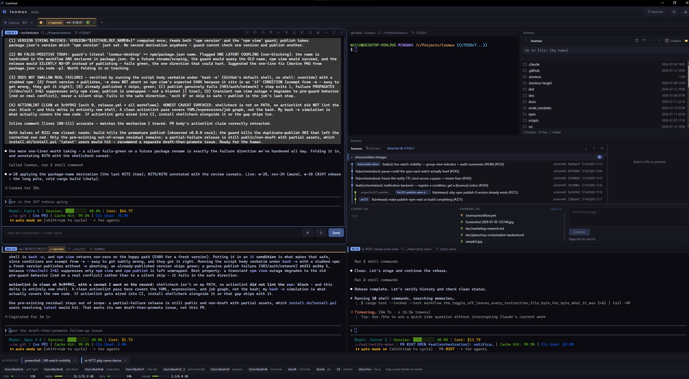

# Loomux

A dead simple terminal multiplexer for AI agent management without all the bloat.

*Loom* + *mux*: a loom is the frame that holds every thread in place while
the fabric is woven — here, the frame holding a matrix of terminal panes,
each one carrying an agent (or just a shell).

[](https://github.com/willem445/loomux/actions/workflows/ci.yml)

Windows Terminal–class smoothness with the multiplexing features it lacks:
instant matrix splits, nameable panes, and a native session browser that
restores Claude Code and GitHub Copilot CLI sessions straight into a pane.



## Install

**npm (any platform)** — if you already have Node 18+:

```sh
npx loomux-desktop            # download + launch in one shot
npm install -g loomux-desktop # then run `loomux` anytime
```

The `loomux-desktop` npm package is a tiny, dependency-free launcher: it
fetches the matching release asset for your platform (Windows installer, macOS
`.dmg`, or Linux `AppImage`), installs/caches it, and launches it. Pass
`--reinstall` to force a fresh download. (The package is named `loomux-desktop`
because the bare `loomux` name on npm belongs to an unrelated tmux tool; the
command it installs is still `loomux`.)

**Windows**

```powershell
powershell -ExecutionPolicy Bypass -c "irm https://raw.githubusercontent.com/willem445/loomux/main/install.ps1 | iex"
```

**macOS / Linux**

```sh
curl -fsSL https://raw.githubusercontent.com/willem445/loomux/main/install.sh | sh
```

Or grab an installer from the [latest release](https://github.com/willem445/loomux/releases/latest).
Builds are unsigned for now — on macOS, if the app is reported as damaged,
run `xattr -cr /Applications/Loomux.app` (the install script does this for you).

## Stack

- **Backend:** Rust + [Tauri 2](https://tauri.app) + [`portable-pty`](https://crates.io/crates/portable-pty)
  (WezTerm's PTY layer — real ConPTY on Windows, forkpty on macOS/Linux, so
  escape sequences, colors, and wide characters render exactly as a native
  terminal; no tmux-style re-emulation quirks)
- **Frontend:** [xterm.js](https://xtermjs.org) (the emulator VS Code uses)
  with the WebGL renderer + Unicode 11 addon, vanilla TypeScript, Vite.
  No UI framework.

### Bundled runtime (Windows)

The Windows installer ships one prebuilt, MIT-licensed runtime — a **modern
ConPTY host** (`conpty.dll` + `OpenConsole.exe`, committed in
`src-tauri/resources/conhost/`) for clean terminal resize. See
[`THIRD_PARTY_NOTICES.md`](THIRD_PARTY_NOTICES.md).

Voice input's whisper.cpp runtime is **not** shipped — it's an opt-in download
(it would add ~150 MB to the installer); see [Voice prompts](#voice-prompts).

## Run

```sh
npm install        # once
npm run tauri dev  # develop (hot-reloads the UI)
npm run tauri build  # produce a distributable app / installer
npm test           # unit tests (Node's built-in runner; no extra deps)
```

## Use

| Action | Shortcut |
| --- | --- |
| Split right | `Ctrl+Shift+E` (or ◫ in a pane header) |
| Split down | `Ctrl+Shift+O` (or ⬓) |
| Close pane | `Ctrl+Shift+W` (or ✕) |
| Rename pane | `F2`, or double-click its title |
| Move focus | `Alt+←/→/↑/↓` (or click) |
| Resize panes | drag the divider between them |
| Reorder / move panes | drag a pane by its header (see below) |
| Maximize pane | `Ctrl+Shift+M` (or ⤢); same keys restore |
| Minimize pane | `Alt+M` (or —); restore from the dock |
| Session browser | `Ctrl+Shift+P` (or the *sessions* button) |
| Open in editor | `Alt+E` (or the `</>` button in a pane header) |
| Steer orchestrator | `Alt+P` (focus the compose strip under an orchestrator pane); `Enter` sends, `Shift+Enter` inserts a newline; `Esc` returns to the terminal; `Ctrl+V` in the strip attaches a pasted screenshot |
| Voice prompt | `Alt+S` (push-to-talk; `Esc` cancels) — see [Voice prompts](#voice-prompts) |
| Copy / paste | `Ctrl+Shift+C` / `Ctrl+Shift+V` (`Ctrl+V` also works) |

A CLI running in a pane (e.g. an agent that says "copied to clipboard") copies
straight to your system clipboard too, via OSC 52 — no manual re-select needed.

Splitting in the same direction adds a sibling column/row — repeated splits
form an even matrix instead of a lopsided staircase.

### Rearranging panes

Panes get cramped fast once the orchestrator opens one per agent, so the grid
can be rearranged without splitting from scratch:

- **Drag to reorder or move** — grab a pane by its header and drag it over
  another pane. A snap preview shows where it will land:
  - drop on the **middle** to *swap* the two panes in place, or
  - drop on an **edge** (left/right/top/bottom half) to move the pane to that
    side, re-splitting the target.
  Release to drop, or press `Esc` to cancel. Swapping two equally-sized slots
  never resizes their terminals, so no scrollback is disturbed.
- **Maximize** (`Ctrl+Shift+M` or the ⤢ button) blows one pane up to fill the
  grid; the same shortcut (or the ⤡ restore button) puts it back. The other
  panes are hidden rather than shrunk, so they don't repaint.
- **Minimize** (`Alt+M` or the — button) parks a pane in the **dock** strip at
  the bottom of the grid — it keeps running. Click its chip to bring it back,
  or the chip's ✕ to close it for good. (This is loomux's take on the issue's
  "minimize to tray": an in-app restore dock rather than the OS tray.)
- **Fold a whole group** — an orchestrator pane has a fold toggle (the stacked
  panes icon in its header, mirrored in the group lifecycle panel) that
  minimizes *every* worker/reviewer pane in its group to the dock at once,
  leaving just the orchestrator. Click it again to restore them all. Handy once
  a big group has opened a pane per agent and you want the screen back without
  ✕-clicking or minimizing them one by one. Folded panes behave like any other
  docked pane — they keep running, still pulse for attention on their dock chip,
  and can be restored individually.

### Session browser

Scans the local machine for resumable agent sessions:

- **Claude Code** — `~/.claude/projects/*/​*.jsonl` (titled by the first
  real prompt, resumed with `claude --resume <id>`)
- **Copilot CLI** — `~/.copilot/session-state/*/workspace.yaml`
  (resumed with `copilot --resume <id>`)

Clicking a session opens a new pane in the session's original working
directory and resumes it there. The pane is auto-named from the session.

### Open in editor

Loomux is a terminal, not an editor — so when you need to open files in a real
editor, the `</>` button in a pane header (or `Alt+E`) launches your editor on
that pane's current folder. The first time, you're asked for the editor
command; it's remembered after that.

- Set it to `code` (VS Code), `zed`, `subl`, or any command on your `PATH`, or
  to a full path to the editor executable.
- The workspace folder is passed as the editor's sole argument, spawned
  detached — the editor keeps running independently of loomux.
- Right-click the `</>` button any time to change the editor command.

If nothing is configured, or the editor can't be found/launched, loomux shows a
short toast explaining what went wrong.

### Voice prompts

Dictate a prompt instead of typing it. Press **`Alt+S`** to start recording
(push-to-talk), speak, and press **`Alt+S`** again to stop — loomux transcribes
your speech locally and drops the text at your current focus. **`Esc`** cancels
at any point (including mid-transcription). Transcription is never auto-submitted:
you review it and press Enter yourself.

- **Where the text lands** follows focus, decided when you start:
  - a **compose/steer box** focused → inserted at the caret;
  - any **terminal pane** focused (an agent, the orchestrator pane, a plain
    shell) → pasted into that pane's input as if typed (bracketed paste, no
    trailing newline).
- The orchestrator steer strip also has a **🎤 button** that records into the
  strip; the hotkey works from any pane, with or without the button.
- Only **one recording** runs at a time. While a capture targets a terminal, a
  badge floats over that pane — red "Recording", then amber "Transcribing…"
  while the speech is being converted. A large model can take a while; the app
  stays responsive and you can `Esc` to abort.

**Local & open source, opt-in.** Speech-to-text is
[whisper.cpp](https://github.com/ggml-org/whisper.cpp) (MIT) running entirely on
your machine — no audio leaves the box, no cloud STT. Loomux does **not** ship
the whisper runtime (it would add ~150 MB to the installer), so voice is opt-in:
install a whisper build and a model once and loomux picks them up automatically.

**Set it up (Windows).** Easiest — run the convenience script from a checkout,
which downloads a pinned, checksum-verified runtime + the `base.en` model into
the location loomux auto-detects (`%LOCALAPPDATA%\loomux\whisper`):

```powershell
powershell -ExecutionPolicy Bypass -File scripts\stage-whisper.ps1
```

Or install by hand:

1. From a [whisper.cpp release](https://github.com/ggml-org/whisper.cpp/releases),
   download the CPU `whisper-bin-x64.zip` and extract **`whisper-cli.exe`
   together with _all_ of its DLLs** — `whisper.dll`, `ggml.dll`,
   `ggml-base.dll`, and every `ggml-cpu-*.dll`. **Missing DLLs are the usual
   cause of a silent "whisper failed to run"**: `ggml` loads the `ggml-cpu-*.dll`
   matching your CPU at runtime, so keep the whole set together.
2. Download a ggml model — e.g. `ggml-base.en.bin` from
   [ggerganov/whisper.cpp](https://huggingface.co/ggerganov/whisper.cpp).
3. Place them where loomux looks by default:

   ```
   %LOCALAPPDATA%\loomux\whisper\whisper-cli.exe      (with the DLLs beside it)
   %LOCALAPPDATA%\loomux\whisper\models\ggml-base.en.bin
   ```

Restart loomux and press `Alt+S`.

**Custom locations (env overrides).** To keep the runtime or model elsewhere,
point loomux at them:

- `LOOMUX_WHISPER_CLI` → a `whisper-cli.exe` (with its DLLs beside it)
- `LOOMUX_WHISPER_MODEL` → any ggml `.bin` (e.g. a larger multilingual model)

Resolution order is **env vars → `%LOCALAPPDATA%`**.

**Performance & tuning.**

- **Threads.** loomux passes `-t` capped at your CPU's parallelism (max 8) —
  whisper.cpp otherwise defaults to 4, so this is a 2× win on a many-core
  machine, without oversubscribing (its CPU inference is memory-bandwidth-bound
  and gains flatten past ~8 threads).
- **Model choice** (biggest speed/quality lever). `base.en` is a fine default;
  for noticeably better accuracy at similar speed, use **`large-v3-turbo`**
  quantized — **`q8_0`** is the quality/speed sweet spot (`q5_0` is smaller/
  faster). Drop the `.bin` in `models\` or point `LOOMUX_WHISPER_MODEL` at it.
- **GPU.** NVIDIA owners get a large speed-up from a **cuBLAS/CUDA** whisper.cpp
  build — download a `cublas` release asset and point `LOOMUX_WHISPER_CLI` at it.
- **Extra flags.** `LOOMUX_WHISPER_ARGS` is appended verbatim to the whisper
  command (whitespace-split, no shell quoting) for power users — e.g.
  `LOOMUX_WHISPER_ARGS="-t 12 -bs 5"`. It comes *after* loomux's args and
  whisper takes the last value of a flag, so your overrides win.

**Vocabulary biasing.** Bias recognition toward your own jargon with an optional
`%LOCALAPPDATA%\loomux\whisper\vocab.txt` — one term or phrase per line, `#` for
comments. loomux assembles it into whisper's `--prompt` (an initial-prompt hint):

```
# loomux project terms
loomux
ConPTY
tmux
gh
xterm
WASAPI
cpal
Tauri
ggml
orchestrator
```

Keep it a **short curated list**: whisper's initial prompt is capped (~224
tokens) and only a curated list is reliably honored — loomux truncates to a
conservative budget and logs a warning if `vocab.txt` is over-long. Set
`LOOMUX_WHISPER_PROMPT` to a raw prompt string to override the file entirely.
(Fine-tuning a model is out of scope — it needs a GPU, a labeled dataset, and a
multi-GB output; `--prompt` gets most of the domain-term benefit for none of the
cost.)

**Windows only** for now; on other platforms the hotkey reports that voice
capture isn't available. See [`doc/design/voice.md`](doc/design/voice.md) for
the architecture and the cross-platform path.

If the mic can't be opened (no device, or Windows microphone privacy blocks it),
or the whisper runtime is missing/misconfigured, loomux surfaces a specific
message rather than failing silently. Recordings are capped at 5 minutes. To
debug a capture, set `LOOMUX_VOICE_KEEP_WAV=1` — loomux keeps the scratch WAV and
logs its path, duration, and level.

### Git view

`Alt+G` (or the ⑂ icon in a pane header) overlays a git panel on the pane,
scoped to the repository the shell is currently in — a commit graph, a diff
preview, and the working-tree changes with staging and commit. It never
resizes the terminal underneath. Press `Esc` (or ✕) to return.

Drag the divider **between the graph and diff** (or **above the changes
strip**) to resize those sub-panes — handy for inspecting wide diffs or busy
branch graphs. Each divider remembers its position across sessions, and neither
side can be collapsed below a usable minimum. As with the overlay's bottom
edge, these dividers only redistribute space *inside* the panel; its outer size
never changes, so the terminal's PTY is never resized.

Toolbar (top-right of the graph):

| Button | Does |
| --- | --- |
| ↓ | **Pull** the current branch — fast-forward only, so it never creates a surprise merge; a diverged branch reports the conflict instead. |
| ↑ | **Push** the current branch. If it has no upstream yet, you're offered to publish it to the remote and set tracking. |
| ↻ | **Fetch** from all remotes (with prune) and refresh the view. |

Click the **branch name** in the header to switch branches — the menu lists
every local branch plus remote-tracking branches (checking a remote one out
creates a local branch tracking it, or switches to the existing local branch of
that name if you've checked it out before).

**Right-click a commit** for its actions: checkout (detached), create a branch
or tag here, cherry-pick / revert / merge / rebase onto the current branch, or
copy the commit hash or subject. **Right-click a branch/tag chip** to check it
out directly (double-click still works too).

History-changing operations (cherry-pick, revert, merge, rebase) ask for
confirmation first. If any of them hit a conflict, loomux aborts the operation
and leaves your working tree exactly as it was, reporting the conflict — it
never leaves you in a half-finished, conflicted state to untangle. Resolve
those in a terminal.

The view (and the pane's header branch chip) also react to changes made
**outside** the pane's shell — a `git checkout`, commit, or stage run from VS
Code or another terminal shows up within a couple of seconds, without you
having to press Enter in the pane. A lightweight backend watch samples the
repo's `.git` metadata (HEAD, index, refs) once a second while a pane has it
open, and feeds the same throttled refresh a shell prompt would; it stops when
the pane closes.

### GitHub issues

`Alt+I` (or the ◉ icon in a pane header) overlays a GitHub **issues** panel on
the pane, scoped to the repository the shell is currently in — the durable
upstream work queue, alongside the git view. Like the git view it floats over
the terminal and **never resizes it**; press `Esc` (or ✕) to return.

It reads and writes through the authenticated **`gh` CLI** — loomux stores no
token or secret; `gh` uses whatever `gh auth login` you already have. If `gh`
isn't installed, or you haven't logged in, the panel says so with a one-line
hint instead of failing calls.

The header carries an **Issues ⇄ PRs** toggle: switch between the repo's open
issues and its open **pull requests**. Both lists share the same filter, sort
(newest-updated first), and detail pane; PR mode is **read-only** — you can
browse, open, and **comment** on PRs, but the panel never labels, merges, or
approves them (do that on GitHub or in the git view).

From the panel you can:

- **Browse** the repo's open issues or PRs (number, title, labels, and when each
  was last updated), newest first. The **filter box** matches on number, title,
  or label. Issue rows already carrying an agent go-signal label are marked with
  an accent stripe; PR rows show their head branch.
- **Open a detail view** by clicking a row: the full description, the whole
  comment thread, and a box to **add a comment** (`Ctrl+Enter` posts; the thread
  refreshes after). `Esc` (or ←) returns to the list. Commenting works on both
  issues and PRs. All GitHub-authored text (descriptions, comments) is rendered
  as plain text, never HTML.
- **Create** an issue (＋) from a title and optional body. `Ctrl+Enter`
  submits. (Creating is issues-only; PR mode has no ＋.)
- **Hand an issue to the orchestrator** by toggling a label directly on the
  row: **ready** applies `agent-ready` (start work) and **investigate** applies
  `agent-investigation` (research + a plan). That's the whole handshake — a
  running orchestrator on this repo polls open issues and pulls any so labelled
  onto its board; no orchestrator needs to be running when you label, since the
  label is durable on GitHub and picked up whenever one next starts here. An
  `agent-managed` label (set by an orchestrator that already owns the issue) is
  shown read-only. If the repo doesn't have these agent labels yet, loomux
  **creates the one you toggle on first use** (with its standard color and
  description) — so the handshake works on a fresh repo without any manual label
  setup; only these allow-listed labels are ever created.
- **Copy** any issue's URL (⧉) to the clipboard.

The panel refreshes on open, when you switch mode, and on the ↻ button — a
single cheap `gh issue list` / `gh pr list` call (and a `gh {issue,pr} view` when
you open a detail), with no background polling.

## Agent orchestration

Loomux natively supports an **orchestrator / worker** pattern: a long-lived
planning agent that manages a small fleet of worker agents, each in its own
visible pane, with a reviewer agent per PR and an optional **planner** agent
that scopes bigger work first — and you only gatekeep the final review and merge.

**Launch:** turn on *✦ agents* mode, open a new pane, and pick
**Orchestrator + workers** in the launcher. Choose the agent CLI and model
**per role** — orchestrator, worker, reviewer, and planner each get their own
CLI (Claude Code or Copilot CLI) and model, so you can mix agent types in one
group (e.g. a Claude orchestrator driving Copilot workers). The top *Agent*
select is the group default that seeds every role; override any role you like.
Model dropdowns are populated by querying the selected CLI's own help, so new
models like `fable` appear automatically, with a custom-entry escape hatch.
Then set the repository, how many idle workers to start with, and the
guardrails: max live agents and permissions. Permissions are either *Auto*
(Claude Code's native auto permission mode plus pre-approved `git`/`gh` and
loomux agent tools — recommended) or *Accept edits only*; loomux never uses
`--dangerously-skip-permissions`. Under *Auto*, **group Copilot** agents run in
Copilot's true **autopilot mode** (`--autopilot`) — an unattended worker should
persist autonomously rather than pause to ask — and loomux answers the resulting
"Enable autopilot mode" consent dialog for them automatically at spawn (your
group-level *Auto* choice is the consent). That's the one place loomux opts an
agent into autopilot mode; a lone single pane, where you're present to answer,
does not (see the launcher's autopilot toggle above). The launcher warns inline
when any selected role's CLI isn't installed, and an agent pane that dies with an
error stays open so you can read what happened. The launcher's **Multiple
panes** mode also spawns N independent agent panes at once (a worktree name fans
out to `name-1 … name-N`).

**Autopilot toggle (single & multiple panes):** a plain agent pane would
otherwise boot in the CLI's default interactive permission mode and prompt on
everything. The **Single pane** and **Multiple panes** modes carry an
*Autopilot — pre-approve all tools (allow all)* checkbox, **on by default**,
that launches the agent with pre-approved tools — Claude Code's native Auto mode
plus pre-approved `git`/`gh`, Copilot's `--allow-all-tools --allow-all-paths`.
The flags come from the backend (the same source the orchestration path uses, so
the two can't drift); the toggle only shows for CLIs that have an unattended mode
(Claude/Copilot), and never for a custom command. Uncheck it to launch in the
CLI's normal interactive mode. Your last choice is remembered as the default
next time (in `localStorage`, like the other launcher prefs).

For a **single pane** the toggle means **tools pre-approved** — the pane stops
prompting you to approve each edit/command. It deliberately does *not* enter
Copilot's "autopilot mode": with a human at the keyboard, Copilot's interactive
framing is correct (it keeps its `ask_user` tool and may pause to ask), and an
unbidden "Enable autopilot mode" startup dialog would just be in your way.
**Group** (orchestrator) Copilot workers are different — see below.

**How it works:** loomux hosts a local MCP server; every agent pane in a
group connects with its own identity token (`--strict-mcp-config`, so
workers see nothing else). The orchestrator plans work as GitHub issues
(labeled `agent-managed`, its "I own this" marker), decides worktree-vs-branch per task by
mergeability, and delegates via tools that *type prompts into the worker's
CLI* — you see every instruction verbatim in the pane, can steer any agent
by typing yourself, and everything lands in an audit log. Workers follow the
standard flow (branch → implement → tests that test intent → docs → PR) and
report back; reviewers post `gh pr review`s. For bigger or sprawling work the
orchestrator can spawn a **planner** first — a read-only agent that explores the
codebase and posts a structured implementation plan (scope, files, test
strategy, risks, and a suggested worker split) as an issue comment, then exits;
the orchestrator turns that plan into worker briefs. A planner's read-only
contract is enforced at the CLI level where possible — it never gets a worktree,
and its file-editing tools plus `git commit`/`git push` are denied — so it
can't edit files or push code; the rest (not opening PRs) rides on its
instructions, since `gh` stays available for the plan comment. **No agent ever
merges** — you do, after your own review.

**Go-signal labels:** you can hand the orchestrator work without typing in its
pane. Label a groomed issue **`agent-ready`** and it gets picked up and driven to
a PR through the normal flow; label one **`agent-investigate`** and a planner
(or the orchestrator itself, for small questions) researches options/feasibility
and posts its findings or a plan as an issue comment (no code) for you to act on.
The orchestrator polls for newly labeled issues and pulls them onto the board
automatically.

Panes are badged by role and group number (`ORCH 1` / `W 1` / `REV 1` / `PLAN 1`
vs `ORCH 2` / `W 2`) with a per-group accent color, so parallel orchestrations — even on
the same repository — pair up at a glance. Unrelated panes are fully
isolated from a group's tools. When the orchestrator spawns an agent it opens
that pane in the background — your keyboard focus stays exactly where you were
typing, so a spawn never yanks the cursor mid-keystroke. Panes you open yourself
(a split, the launcher, a session restore) still take focus as before.

**Task board:** the orchestrator pane has a board toggle (`Alt+T` or the
list icon) showing the group's work queue — status per item (`queued`,
`in-progress`, `review`, `pr`, `human-testing`, `done`, `blocked`), issue/PR
links, notes, and priority order. You can add, edit, annotate, reorder, and
delete tasks; the orchestrator is notified of your edits and maintains the
same board through its tools. Issue and PR chips are **clickable** — they open
in your browser.

**Clear done:** when the board holds any `done` items, the header shows a
**🗑 done (N)** button that deletes them all in one action (two-click confirm,
so a mis-click can't wipe the board). The whole batch is a single backend
operation, so the orchestrator hears about it **once** — one *board updated*
notice for the sweep, not one per task deleted.

**Delete selected:** tick the checkbox on any rows you want gone and the header
shows a **🗑 selected (N)** button that deletes exactly those, by id, in one
action (same two-click confirm and single coalesced notice as clear-done). The
selection is pruned to live rows on every refresh, so a task the orchestrator
removes out from under you drops out of the count; ids that no longer exist by
the time you confirm are skipped, not errored.

**Start:** a `queued` item shows a **▶ Start** button — your nudge to have the
orchestrator begin work on it now. Clicking it records a human note on the task
and delivers a *begin work* prompt to the orchestrator pane (same delivery path
as the merge-gate buttons). It deliberately leaves the status at `queued`: the
orchestrator flips it to `in-progress` when it actually assigns a worker, so the
board reflects real assignment rather than intent. If the group is **paused**,
Start is refused up front with a toast (resume first) — a paused group's
delivery is suppressed, so the nudge would otherwise be silently lost.

**Merge gate:** when an item reaches `pr` or `human-testing` — the point where
only you can decide — the board shows two buttons instead of making you type
into the orchestrator. **✓ Approve** marks the item done and tells the
orchestrator to merge. **✎ Changes** opens a box for your findings, records
them on the board, and sends them to the orchestrator to route back to a
worker. Both land as a message in the orchestrator pane, exactly as if you'd
written it.

**Steering strip:** the orchestrator pane has a thin compose field docked
under its terminal (styled like the board's *Add a task* field). Type steering
there and press **Enter** — loomux enqueues it to the orchestrator through the
*same* serialized delivery path worker reports use, so your message and an
incoming report can never land in each other's text: the pane's input has
exactly one writer. The field wraps and grows to a few lines as you type;
**Shift+Enter** inserts a newline for a multi-line message, and past a few lines
it scrolls internally rather than pushing the terminal (the strip floats over
it, so the PTY is never resized). Focus the strip with **Alt+P** (or click it);
**Esc** hands focus back to the terminal. Because it's a loomux field and not the CLI's own
input box, it never steals the terminal's keys — type freely in the terminal
and the strip stays out of the way. Steering a paused group or a pane with no
live orchestrator is reported inline rather than silently dropped. You can
still type directly into the CLI if you prefer; loomux holds an incoming report
for a few seconds while it sees you typing there (see the design note), but the
strip is the collision-proof path.

*Attach a screenshot:* paste an image with **Ctrl+V** (or click the paperclip
to pick files) and it joins the message as a thumbnail chip — remove one with
its **✕**, or queue several. On send, loomux saves each image to the group's
scratch dir and adds an `Attached image:` reference line to the message —
formatted the way the orchestrator's CLI reads it (a plain path for Claude
Code, an `@<path>` mention for Copilot) — so the agent opens the screenshot.
PNG, JPEG, GIF, WebP, and BMP are accepted, up to 10 MB each and 8 per message;
the saved files are cleaned up when the group ends.

**Attention routing:** the human is the scheduler's bottleneck, so loomux
surfaces *which* pane needs you instead of making you scan them. A pane earns a
pulsing **needs-attention** chip when an agent is parked on a prompt only you
can answer (a permission dialog or question — detected from the pane going
output-quiet on a prompt-shaped last screen, the same output heuristics the
stalled-agent watchdog uses, and suppressed while you're typing into it), when a
worker **reports** done or blocked, or when its task reaches a **human merge
gate**. Turning to the pane (or clicking the chip) clears a report badge; live
signals clear themselves when the condition passes. On the task board, items
that only you can advance (`pr`, `human-testing`, `blocked`) are highlighted so
what's waiting on you stands out. Each group also has an optional **desktop
notification** toggle (🔔 in the group lifecycle panel) that raises an OS toast
for those report/blocked/idle-with-prompt events — off by default, durable
per-group. Badges and highlights are header/board overlays; nothing ever
resizes the PTY.

**Audit viewer:** every orchestration pane has an audit toggle (`Alt+A` or
the history icon) opening the group's `audit.jsonl` as a filterable timeline
— every prompt, spawn, task edit, delivery outcome, and state write, one row
each. Filter by actor, action, or agent; free-text search the details;
expand any row to read the full prompt/task text verbatim (the field that
made this log worth grepping). A **follow** button live-tails new lines, and
rotation is transparent (the rotated `audit.1.jsonl` generation is read
alongside the current one). The overlay floats over the terminal like the
git and task-board views — it never resizes the PTY.

**Group lifecycle:** the orchestrator pane has a lifecycle toggle (`Alt+O` or
the group icon) with a one-glance summary — how many agents are live, the role
breakdown, uptime (per agent and for the whole group), each agent's state, and
running session cost with a group total. From here you can **pause** the group
(loomux stops delivering prompts so its agents finish their turn and idle out —
reversible with resume) or **End orchestration**, which kills *every* agent in
the group at once instead of ✕-clicking panes one by one. Ending is destructive,
so it takes a second confirming click; an optional **remove worktrees** checkbox
also deletes each agent's git worktree (uncommitted changes are lost, but the
branches — where the PRs live — are always kept). The teardown is audited, closes
the group's panes for you, and clears any pause so a later relaunch starts clean.
The panel also carries a **max live agents** stepper (1–12): adjust the cap on
the fly and loomux persists it, audits the change, and drops a one-line notice
into the orchestrator pane so it re-plans against the new ceiling. Lowering the
cap below the current live count never kills anyone — it just blocks new spawns
until agents finish and attrition brings the count back under the cap.
The panel also carries a **Fold panes** button — the same group-wide
minimize/restore toggle as the orchestrator header — for reclaiming screen space
when a group grows large (see [Rearranging panes](#rearranging-panes)).

**Per-task sessions:** each worker is scoped to exactly one work item, and
loomux records its session id on the roster and task board. Claude ids are
pre-assigned at spawn; Copilot mints its own id on boot, so loomux watches
`~/.copilot/session-state` and binds the pane's new session a few seconds
after it starts. Either way, follow-ups on a finished task *resume* that
worker's session (same context, same workspace) instead of cold-starting a
new agent or disturbing a busy one — for Claude and Copilot groups alike.

**Guardrails** are enforced by loomux, not the model: a cap on live agents
(≤12, set at launch and adjustable live from the lifecycle panel), models
pinned per role at launch, and the permission mode fixed at group creation
(native auto mode or acceptEdits — never bypass).

**Autonomous mode** (off by default, toggled live per group) lets an idle
orchestrator drive its own monitoring/intake cadence: when its pane goes
output-quiet, loomux delivers a periodic `[loomux] idle tick` so it re-syncs,
picks up `agent-ready`/`agent-investigate`-labeled issues, and re-checks open
PRs without anyone typing — the label funnel stays the consent boundary (it
never acts on unlabeled issues). Two cost/safety controls ride with it: a
per-group **token budget** that suspends autonomous ticking (and notifies you)
once autonomous-era spend crosses the cap, and an **auto-merge** toggle
(default off = you merge) that, when on, lets the orchestrator merge an
adequately-tested PR itself (reviewer-approved + green CI + acceptance met),
still holding anything risky for you. Every toggle and merge is audited.

You drive all three from the **lifecycle panel** (`Alt+O`), in its *Autonomous
mode* section: an **Autonomous** on/off toggle (blunt about the trade-off —
autonomous ticks spend tokens without you present), a **Require human approval
before merge** checkbox (on by default = today's human merge gate; clearing it
is what enables auto-merge), and a **token budget** field (0 or empty = no cap).
While autonomous mode is on, a live meter under the budget shows autonomous-era
spend against the cap (progress bar, percent, and human-readable token counts),
metered from the moment you enabled it — not lifetime history. If the budget is
exhausted, the panel switches to a distinct **suspended: budget exhausted**
state; flipping the Autonomous toggle back on resumes ticking and re-anchors the
meter at the current spend. The budget can also be pre-set at group creation via
the launcher's **Autonomy budget** guardrail field, though autonomous mode still
starts off until you enable it.

**Restart after loomux closes:** orchestration sessions are marked in the
session browser (`ORCH` / `W` / `REV` chips). Clicking a dead group's
orchestrator session restores the *whole* orchestration — same group id,
state, task board, and audit history, with fresh MCP identity wired into
the resumed conversation. Worker/reviewer sessions rejoin their group when
it's running. A plain `claude --resume` would come back powerless (no MCP
tools, no task board); this path never does.

**Persistence:** each group keeps durable state under
`<data dir>/loomux/orchestration/<group>/` — `state.json` (the
orchestrator's queue/plan memory, written via a tool after every change),
`audit.jsonl` (every tool call, prompt, spawn, and exit, one JSON line
each), `agents.json` (the roster: which sessions belonged to which role),
and the rendered role instructions. The group id is derived from the
repo path, so relaunching an orchestrator on the same repo resumes its
state; GitHub issues remain the source of truth for the work queue.

**Crash logs:** loomux writes forensics under `<data dir>/loomux/logs/` — a
Rust panic hook drops `crash-<timestamp>.log` (message, thread, backtrace),
and a rotating `breadcrumbs.log` records lifecycle events (pane/PTY
open/close, agent spawn/exit, delivery outcomes) with no prompt content. If a
run exits uncleanly, the next launch surfaces a toast naming the newest crash
log. See `doc/design/crash-observability.md`.

Requirements: `claude` CLI on PATH; `gh` CLI authenticated for the
issue/PR/review workflow.

## Architecture

```
src-tauri/src/
  pty.rs            PTY lifecycle (spawn/write/resize/kill) + output streaming
  sessions.rs       agent session discovery (one scan_* fn per agent source)
  orchestration/    agent groups: registry, guardrails, MCP server, audit
  obs.rs            crash observability: panic hook, breadcrumb log, unclean-exit notice
  voice.rs          voice prompts (#58): mic capture (cpal) → local whisper.cpp subprocess
  lib.rs            Tauri wiring
src/
  pty.ts            typed bridge to the backend (invoke + event bus)
  pane.ts           one terminal pane: xterm instance + header UI
  grid.ts           split-tree layout, dividers, focus, drag/maximize/minimize
  layout.ts         pure drag-reorder geometry (unit-tested, DOM-free)
  sessions.ts       session browser sidebar
  launcher.ts       new-agent-pane dialog (single / multi / orchestrator)
  orchestration.ts  frontend half of agent groups (panes, badges, focus)
  shortcuts.ts      app-level keybindings (single source of truth)
  voice.ts          pure voice logic: target decision + push-to-talk state machine
  voicecontrol.ts   global single-capture controller; routes transcripts to focus
  main.ts           composition root
```

The seams for future AI features (ccmux-style agent status, notifications,
orchestration) are deliberate:

- **New agent sources**: add a `scan_*` function in `sessions.rs`.
- **New backend capabilities**: add a `#[tauri::command]` and a typed
  wrapper in `pty.ts` — the frontend never touches IPC directly elsewhere.
- **Pane awareness** ("agent is waiting for input" badges): realized as
  attention routing (see above). The backend's `run_attention` scan reads each
  pane's pty output counter + tail + last-keystroke time (observed in `pty.rs`'s
  reader thread) and emits an `orch-attention` event the frontend badges panes
  from; add a new attention source in `attention_tick`.
