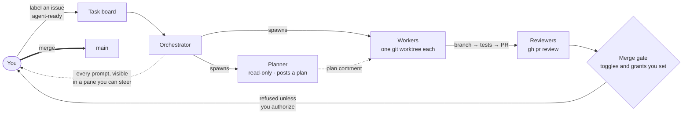

# Loomux

**A terminal multiplexer for AI coding agents — hand it a goal and a queue of
work, and let it run.**

[](https://github.com/willem445/loomux/actions/workflows/ci.yml)
[](https://willem445.github.io/loomux/)


Loomux is a native desktop terminal for Windows, macOS and Linux — instant matrix
splits, nameable panes, project tabs, session restore — with an
**orchestrator/worker workflow built in**. Point a group at a repo, label some
GitHub issues, and an orchestrator plans the work, spawns workers and reviewers
into their own panes and their own git worktrees, and drives each issue to a pull
request.

Every prompt it sends is *typed into a pane you can read* — so you can steer any
agent mid-task by just typing, or take the keyboard entirely. And no agent merges:
that button stays yours.

*Loom* + *mux* — a loom is the frame that holds every thread in place while the
fabric is woven.

## Quickstart

```sh
npx loomux-desktop            # Node 18+, any platform — downloads and launches
npm install -g loomux-desktop # …or install it and just run `loomux`
```

<details>
<summary>Other install paths — Windows / macOS / Linux one-liners, release assets, betas</summary>

**Windows**

```powershell
powershell -ExecutionPolicy Bypass -c "irm https://raw.githubusercontent.com/willem445/loomux/main/install.ps1 | iex"
```

**macOS / Linux**

```sh
curl -fsSL https://raw.githubusercontent.com/willem445/loomux/main/install.sh | sh
```

Or grab an installer from the
[latest release](https://github.com/willem445/loomux/releases/latest) (`.exe`/`.msi`,
`.dmg`, `.AppImage`/`.deb`/`.rpm`).

`npx loomux-desktop` and both one-liners always resolve the latest **stable**
release — beta/RC builds are published as GitHub prereleases only, so grab those
from [the releases page](https://github.com/willem445/loomux/releases) directly.

Builds are unsigned for now — on macOS, if the app is reported as damaged, run
`xattr -cr /Applications/Loomux.app` (the install script does this for you).

</details>

Then, in the app: open a pane → **Orchestrator + workers** → pick the repo, an
agent CLI and model per role, and how many workers to start with. You'll need the
`claude` or `copilot` CLI on `PATH`, and an authenticated `gh` for the issue/PR
flow. Full walkthrough in [Getting started](https://willem445.github.io/loomux/getting-started).

## Hand it a batch of work and walk away

Label a few issues `agent-ready`, set a token budget, flip **Autonomous mode** on
— and close the laptop. The orchestrator keeps pulling labeled work off the board
for as long as you leave it running, hours or days, without you poking it.

That's only sane because the guardrails live in loomux itself, outside the agent
process — not in a prompt asking an agent nicely:

- **It won't merge or publish.** Every agent pane runs behind a `gh`/`git` shim
  that *refuses* a default-branch merge or a release/tag push unless you
  authorized it — with a one-click, single-use, 30-minute grant for one specific
  PR, or a blanket toggle you turned on yourself. Auto-merge and auto-release are
  separate opt-ins, both off by default. The shim is the always-on first layer,
  and it's honest about being one: it raises a bad unattended merge from "type one
  command" to "deliberately evade a named control", but a determined agent with
  shell access can still route around a client-side check. For a boundary nothing
  can talk past, give your agents a machine account with no merge rights on the
  default branch and no tag-push rights — the two layers compose, and
  [the docs walk through both](https://willem445.github.io/loomux/autonomous-mode#the-merge--release-gate).
- **It can't overspend.** Crossing the token budget suspends autonomous mode
  unconditionally — even if the state file can't be written — and the suspension
  survives a restart.
- **It doesn't burn tokens on nothing.** Before waking the orchestrator, loomux
  runs a zero-token, host-side check for actual new work (`gh issue list` /
  `gh pr list`, no LLM turn). A tick with nothing to report is skipped quietly.
- **It survives a restart.** Queued prompts live on disk and re-queue in order
  when their pane is back; a whole group resumes, orchestrator first.
- **Nothing wedges silently.** A prompt that reaches a pane but never gets
  submitted is re-sent once; when re-sending isn't safe, the pane raises a red
  **stuck prompt** chip instead of waiting forever.

Prefer to stay in the loop? Leave autonomous off — that's the default, and the
orchestrator then only acts when you or a worker poke it.

## How a group works


```mermaid
flowchart LR
    You(["You"]) -->|"label an issue<br/>agent-ready"| Board["Task board"]
    Board --> Orch["Orchestrator"]
    Orch -->|"spawns"| Plan["Planner<br/>read-only · posts a plan"]
    Orch -->|"spawns"| Work["Workers<br/>one git worktree each"]
    Plan -.->|"plan comment"| Work
    Work -->|"branch → tests → PR"| Rev["Reviewers<br/>gh pr review"]
    Rev --> Gate{"Merge gate<br/>toggles and grants you set"}
    Gate -->|"refused unless<br/>you authorize"| You
    You ==>|"merge"| Main["main"]
    Orch -.->|"every prompt, visible<br/>in a pane you can steer"| You
```

Workers and reviewers *always* get their own dedicated git worktree — cut fresh
from the default branch — so your own clone is never checked out, branched or
committed to from under you, and parallel work starts from a clean base. The
planner is read-only: no worktree, no file edits, no `git commit`/`push`,
enforced at the CLI level.

## What else is in the box

- **Agent-aware panes** — alert chips when a CLI needs you, badges per role and
  group, and a session browser that restores Claude Code / Copilot CLI sessions
  straight back into a pane.
- **Custom agent workflows** — commit a `.loomux/workflow.yml` and your repo
  declares its own roster and merge gate: five focused reviewers with five
  prompts and five models, an advisor the orchestrator consults when stuck, a
  process agent that mines a finished session into a proposed lessons PR.
- **A real terminal underneath** — WezTerm's PTY layer and xterm.js, so escape
  sequences, colors and wide characters render like a native terminal. Panes
  never resize for a UI feature.
- **Git, issues, files, voice** — a git view, GitHub issues, a file editor, a
  file explorer and push-to-talk voice prompts, each one keystroke away. Float
  them over the terminal, or **dock** up to three of them beside it (left, right,
  bottom) with a draggable divider.
- **Audit everything** — every prompt, spawn, gate decision and toggle change is
  one filterable row in the group's audit log.
- **Lessons that outlive a session** — a committed `.loomux/lessons.md` feeds
  hard-won repo knowledge into the next orchestrator's kickoff.

## Why loomux over…

- **tmux / zellij / [herdr](https://github.com/ogulcancelik/herdr)** — they
  multiplex your agents; loomux manages your agents' *work*.
- **Prompt-layer orchestrators
  ([superpowers](https://github.com/obra/superpowers),
  [gstack](https://github.com/garrytan/gstack),
  [oh-my-claudecode](https://github.com/yeachan-heo/oh-my-claudecode),
  [gsd-pi](https://github.com/open-gsd/gsd-pi))** — review gates written as
  prompts *inside* one agent CLI, which an agent can talk its way past. Loomux
  gates from outside the process instead — host-side, and backed by a machine
  account when you want it airtight. Complementary, not competing — install them
  inside a worker's pane.
- **IDE-shaped agent platforms** — loomux is still a terminal: lightweight,
  native, and it opens *your* editor instead of embedding one.
- **Unattended fleets you can't see** — every agent here works in a pane you can
  read and interrupt mid-task, and the merge button stays human by default.

## Documentation

**User docs → <https://willem445.github.io/loomux/>**

- [Getting started](https://willem445.github.io/loomux/getting-started) — install, first launch, first agent pane
- [Core concepts](https://willem445.github.io/loomux/core-concepts) — pane kinds, the split grid, the shortcut table
- [Orchestration guide](https://willem445.github.io/loomux/orchestration) — groups, the task board, the label handshake, cross-workspace channels
- [Autonomous & supervised modes](https://willem445.github.io/loomux/autonomous-mode) — idle ticks, token budget, auto-merge/release, dangerous mode
- [Troubleshooting](https://willem445.github.io/loomux/troubleshooting) — whisper DLLs, `gh` auth, mic permission, disk

The site is built from Markdown under [`docs/`](docs/) and published on each
release by [`.github/workflows/docs.yml`](.github/workflows/docs.yml).

## Develop

Rust + [Tauri 2](https://tauri.app) + [`portable-pty`](https://crates.io/crates/portable-pty)
on the back end; [xterm.js](https://xtermjs.org) + vanilla TypeScript + Vite on the
front end, no UI framework.

```sh
npm install          # once
npm run tauri dev    # develop (hot-reloads the UI)
npm run tauri build  # produce a distributable app / installer
npm test             # frontend unit tests (Node's built-in runner)
```

Backend checks (what CI gates on) run from `src-tauri/`: `cargo check --locked`
and `cargo test --locked`.

- **[`CLAUDE.md`](CLAUDE.md)** — hard constraints and code conventions. Read it
  before changing code.
- **[`doc/design/architecture.md`](doc/design/architecture.md)** — the source tree,
  module by module, and the extension seams.
- **[`doc/design/`](doc/design/)** — per-feature design notes: *why* each subsystem
  is built the way it is.
- **E2E** (experimental, `e2e-windows` CI job) — Playwright over CDP against the
  real WebView2 webview: [`doc/design/e2e-testing.md`](doc/design/e2e-testing.md).
- `LOOMUX_DATA_DIR` redirects the **entire** app-data root to an absolute path,
  for a fully isolated second profile (the E2E harness uses it). Empty or relative
  values are rejected rather than resolved against the working directory.

The Windows installer ships one prebuilt, MIT-licensed runtime — a modern ConPTY
host (`conpty.dll` + `OpenConsole.exe`, committed in
`src-tauri/resources/conhost/`) for clean terminal resize; see
[`THIRD_PARTY_NOTICES.md`](THIRD_PARTY_NOTICES.md). Voice input's whisper.cpp
runtime is **not** shipped — it's an opt-in download.
