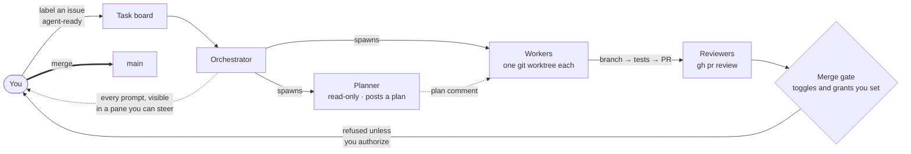

# Design note: the group-workflow diagram

The README's `## How a group works` section shows a designed SVG
(`docs/img/workflow-diagram.svg`) of the same flow described in
`docs/orchestration.md`'s "How it works": you define the vision, the
orchestrator grooms it into issues and board tasks, spawns a planner where
warranted and workers in isolated worktrees, routes work through adversarial
review gates and CI, and only a verdict-gated merge reaches `main`.

This Mermaid flowchart is the **maintainable source** for that same flow —
edit it here and re-export the README's SVG to match. It lives here rather
than under `docs/` (the published user-docs site) because that site's
`just-the-docs` theme has no `mermaid:` key configured, so a Mermaid fence
there would publish as raw, unrendered DSL rather than a diagram. GitHub's
own file viewer renders a Mermaid fence natively with no configuration
needed — the same mechanism the README's diagram relied on before this SVG
replaced it.

